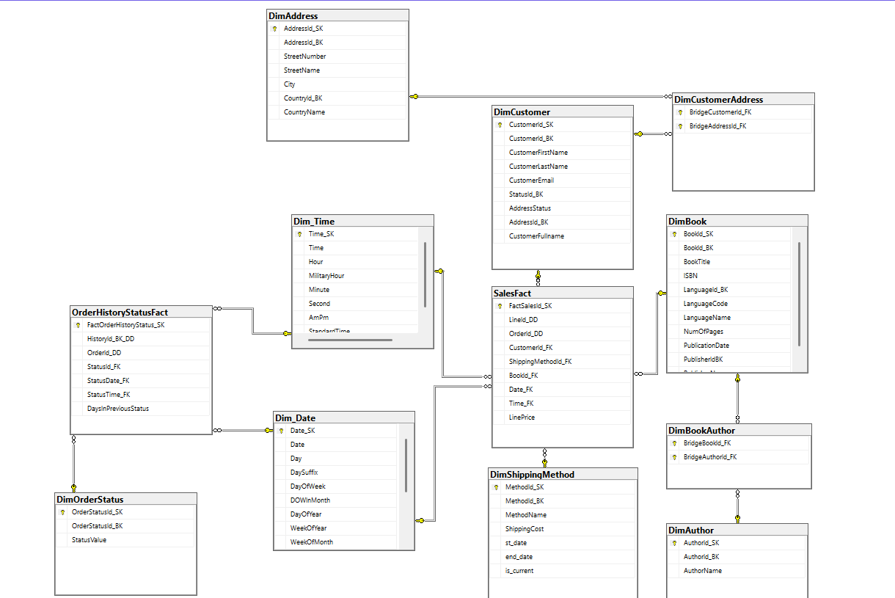
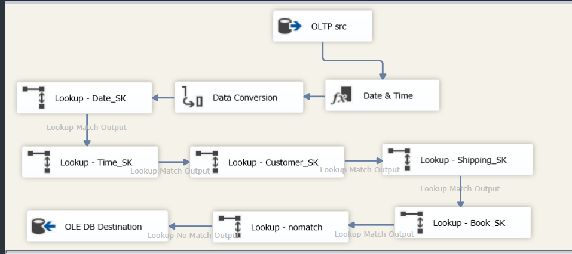
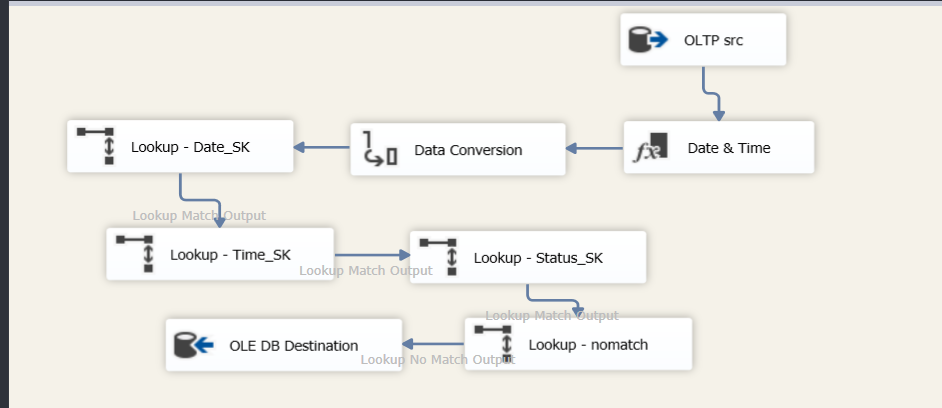
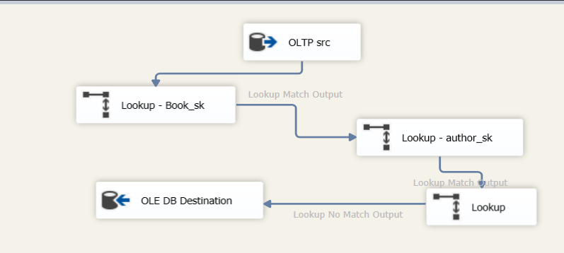
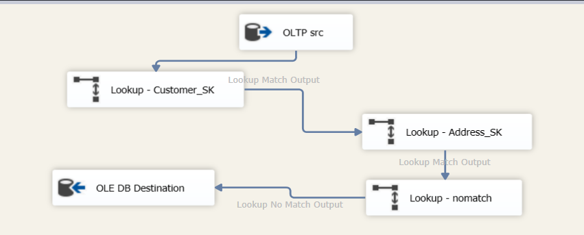
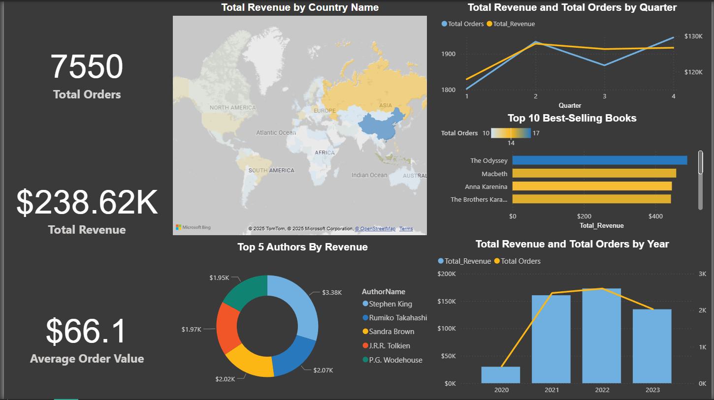

# Online Book retail

## Project Overview

This project involved the end-to-end development of a robust Data Warehouse (DWH) using ` SSMS ` and an interactive ` Power Bi ` dashboard for GravityBooks, a simulated online book retailer. The goal was to transform raw operational data into a structured, analyzable format and build a powerful dashboard to uncover actionable insights into sales performance, customer behavior, and product trends.

## Data Model (Galaxy Schema)

**Facts Tables**

SalesFact: Contains granular transaction data (e.g., LinePrice, OrderId_DD, Date_FK, CustomerId_FK, BookId_FK, ShippingMethodId_FK).

OrderHistoryStatusFact: Tracks the order historical status (e.g. OrderStatus, StatusDate, StatusName, DaysInPreviousStatus).

**DWH Diagram**

## SSIS Key Packages

**SalesFact**

**OrderHistoryStatusFact**

**BookAuthorBridge**

**CustomerAddressBridge**

## PowerBi Interactive Dashboard

## Key Challenges & Solutions

Many-to-Many Relationships: The relationship between Books and Authors was resolved using a bridge table (DimBookAuthor) and correctly handled in both the SSAS cube and Power BI with custom DAX measures (Author Revenue) to prevent double-counting. Same thing for Customer and Address (DimCustomerAddress).

Calculated Revenue Logic: Shipping cost was correctly applied at the order level, not the order line level, to avoid overstating revenue. This was implemented via a DWH column and a simple, accurate DAX measure.

SSAS Attribute Keys: Prevented duplicate key errors during cube processing by ensuring dimension attributes used unique surrogate keys (*_SK) instead of potentially duplicate business keys.

Performance: Leveraged the SSAS cube for complex queries and pre-aggregation, while using direct DWH connections for full control over specific measures.
